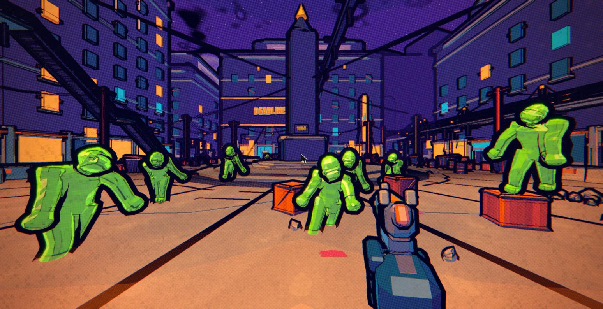
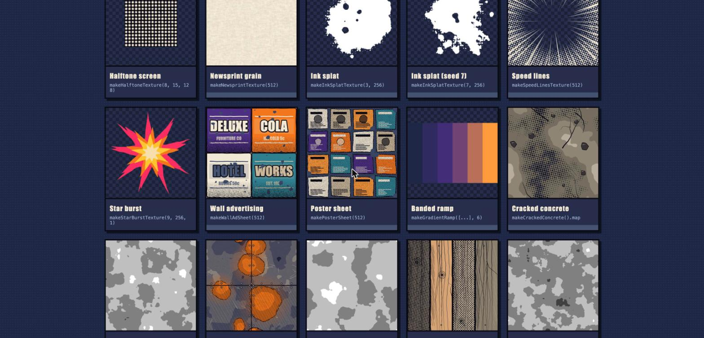
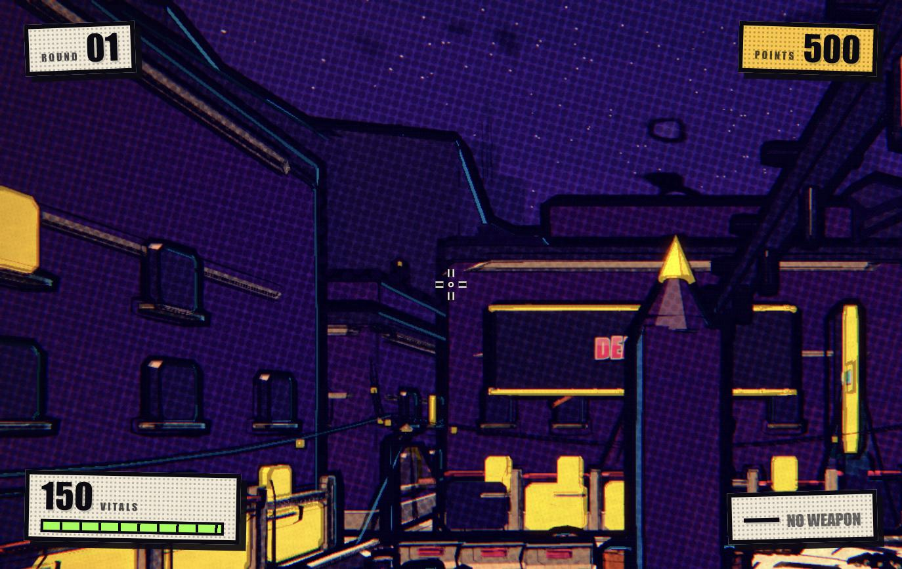
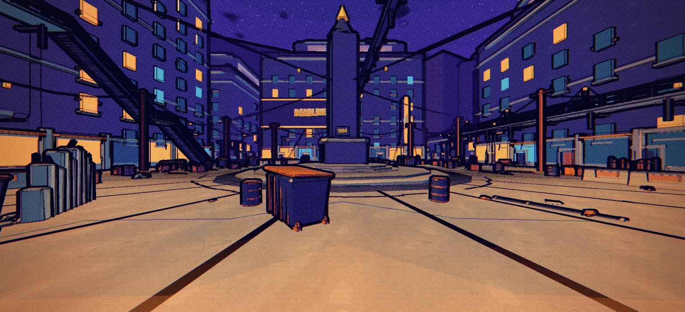
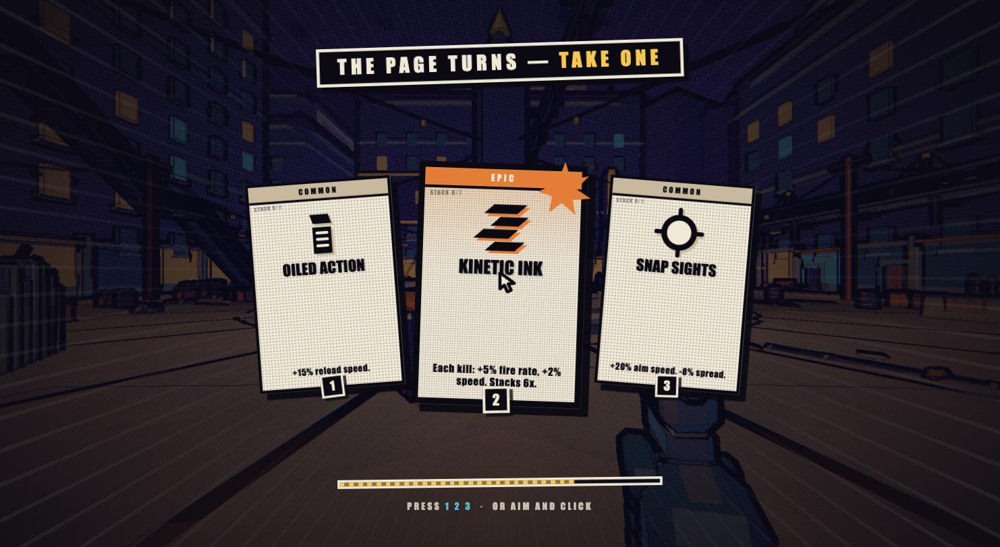
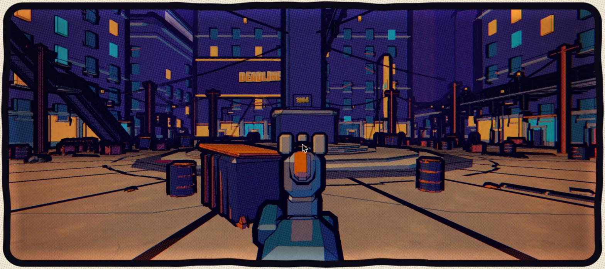

<div align="center">

# COMIC ZOMBIES

### A game that draws itself.

**A Call-of-Duty-style round-based zombies shooter that runs in a browser tab, styled like a graphic novel — with zero downloaded assets.**

[**▶ PLAY IT**](https://comic-zombies.vercel.app/play) · [**SEE EVERY ASSET**](https://comic-zombies.vercel.app) · [Design](docs/GAME_BIBLE.md) · [Art rules](docs/ART_DIRECTION.md) · [Playtest log](docs/PLAYTEST.md)



`43,645 lines of TypeScript` · `1 runtime dependency` · `0 asset files` · `~326 kB gzipped`

Built with [Claude Code](https://claude.com/claude-code) in about a day.

</div>

---

## No models. No textures. No audio files. No webfonts.

Not "compressed small". **Not there.** There is no `assets/` folder, because there is nothing to put in it.

Every mesh is built from code. Every texture is painted to a `<canvas>` at boot. Every sound is synthesised from oscillators and noise. Every comic `BLAM!` is drawn from a system font with three offset outline layers. The whole game is JavaScript that draws itself into existence when you open the tab.

The entire dependency list:

```json
{ "three": "^0.185.1" }
```

### See for yourself

The site's landing page is an **asset gallery** that imports the game's *own* modules and runs the *same* generators, live, in front of you. It can't drift into being a pretty lie — if a generator changed, the gallery changes with it. Every tile prints the exact function call that produced it.

[](https://comic-zombies.vercel.app)

<div align="center"><sub><b><a href="https://comic-zombies.vercel.app">comic-zombies.vercel.app</a></b> — 122 generated assets, rendered in your browser, in about 300 ms</sub></div>

---

## Why bother?

Because the constraint **drives the art direction** instead of fighting it.

Bold, flat, ink-outlined comic art is *achievable in code* at a quality that reads as premium. Photorealism is not. So the style was chosen to fit the constraint — and then the constraint was never broken once.

```
TypeScript ──┬──► Canvas 2D ─────────────► textures, lettering, decals
             ├──► GLSL + BufferGeometry ─► shading, meshes, ink outlines
             └──► WebAudio ──────────────► every single sound
```

It also means the game loads in seconds, weighs less than a single 4K texture, and every asset is a diff you can read.

---

## How it's made

| Layer | How |
|---|---|
| **Textures** | Painted with the Canvas 2D API at boot. Halftone screens, newsprint grain, ink splats grown from metaball fields then noise-eroded, and tiling surface sets (concrete, rust, planks, brick, facades) that each return a colour map *and* a "break-up" map driving halftone density and rim response. |
| **Geometry** | Chamfered boxes, faceted cylinders, vertices jittered so nothing is CAD-perfect. A seeded prop kit — barrels, crates, dumpsters, fences, lamps, broken walls, rubble — filling a 140×140 m arena, merged into buckets to hold the draw-call budget. |
| **Characters** | Procedurally skinned meshes: bones, skin weights solved from bone-segment distance, and per-instance proportion rolls so no two zombies share a silhouette. |
| **Lettering** | Canvas-drawn from a bold **system** font stack (Impact, Arial Black — OS fonts, never a downloaded webfont), with three offset outline layers, a hard drop shadow and roughened ink edges. |
| **Shading** | `InkMaterial`, custom GLSL: three-band cel light with a hard terminator, screen-space halftone filling the shadow band, Fresnel rim, hard-clipped cartoon gleam. Silhouettes from inverted-hull outlines, interior creases from a depth+normal Sobel pass. |
| **Audio** | Oscillators, code-generated noise buffers, filters, envelopes, and a convolution reverb built from a *generated* impulse response. 65 recipes, zero samples. |

---

## The one rule that mattered most

Early builds made the playtester ill. Their exact words: *"every pixel seems to be jumping like glitching."*

The fix wasn't a bug fix. It was a principle:

> ### A comic page does not animate its own texture.
> Paper doesn't shimmer. Halftone dots don't crawl. CMYK plates don't re-register every frame. Those things are **printed** — nailed to the page, and they never move.

| Layer | Rule |
|---|---|
| Halftone lattice | Perfectly static in screen space |
| Paper grain | Static — one sheet, not a new one every frame |
| Chromatic misregistration | One constant offset per session, like one bad print run |
| Boiling ink line | 12 fps, hero contours only, hard coverage budget |

The measurable version: with the camera parked, consecutive frames must differ by **under 0.5% of pixels.**

**It went from 24.77% → 0.065%.** Stand still in the finished game and the image is genuinely frozen. Only the world moves.

---

## What a milestone actually looks like

Same plaza, one milestone apart. The playtester's note was *"we need better coloring"* — so the next milestone measured the frame, found **49% of pixels below 0.1 luminance and only 10% in the midtone band**, and rebuilt the palette around a warm/cool split with a documented value ladder.

| Before | After |
|---|---|
|  |  |
| 49% void · 10% midtone · 2 hue clusters | 19% void · **49% midtone** · warm/cool split |

Three latent bugs turned out to be most of it: **every colour was being converted sRGB→linear twice**, crushing every shadow to black; **all 55 ground light pools were backface-culled** and had never once been visible; and a `mapScale` parameter meant *world metres* in one place and *−0.5…0.5 per face* in another, stretching a fraction of one texture tile across a whole building.

---

## How it was built

Not "one prompt, one game." The project runs like a small studio.

```
MILESTONE ──► AGENTS BUILD ──► ADVERSARIAL REVIEW ──► FIX PASS ──► HUMAN PLAYS
    ▲                                                                   │
    └──────────────── feedback outranks the plan ◄──────────────────────┘
```

Seven milestones in about a day. Each ends in a build a human actually plays, and **their feedback sets the next milestone** — not the roadmap. The whole log, with real playtest notes and what changed because of them, is in [`docs/PLAYTEST.md`](docs/PLAYTEST.md).

The split that makes it work:

| Agents verify (cheap, objective) | The human judges (fast, free, better) |
|---|---|
| Types, build, console | Does it look good? |
| Draw calls, triangles, frame time | Does it feel good? |
| Allocation, leaks, determinism | Is it fun? |
| Hit registration, pathing, reachability | Is anything ugly or annoying? |

Machines are good at *"is this leaking."* They're bad at *"is this satisfying."* So every milestone ends by writing a short [`docs/HUMAN_JUDGE.md`](docs/HUMAN_JUDGE.md) — 10–15 items, each testable in under a minute, with a blank line for the answer.

### What adversarial review actually caught

Every one of these had already passed its own author's tests:

- **Every zombie rendered translucent.** The depth prepass used a stock material that couldn't run the vertex shader posing the body. Two individually-correct decisions, broken only in combination.
- **Slide was silently dropped on every kill.** Input edges died on frames that ran zero fixed steps — and hitstop, added a milestone later, opened exactly that hole on every kill.
- **Knockback was squared.** A units mismatch across a module boundary produced 386 m/s: one headshot threw a zombie 65 m, so every follow-up shot missed.
- **The player floated instead of falling.** `grounded` was only ever set true, never derived from the world. Measured: 0 of 17 ledges fell.
- **`tryStepUp` was structurally unreachable.** Collision returned the *ground* normal whenever grounded, so pressing into a stair riser reported "floor" — and nobody could climb stairs. 46/54 → 54/54.
- **A latent re-entrancy only a later feature could reach.** An explosive boon damaged an enemy from inside that enemy's own hit event, corrupting the pool and stranding rounds forever — invisible until the boon existed.

---

## The game

<table>
<tr>
<td width="50%"></td>
<td width="50%"></td>
</tr>
<tr>
<td><b>26 boons</b>, drawn 3-at-a-time between rounds, stacking multiplicatively into builds that go off the rails on purpose.</td>
<td><b>Deterministic recoil patterns</b> — learnable, not random — plus an active-reload timing window and iron sights that actually line up.</td>
</tr>
</table>

Round-based survival on CoD's real health curve (150 HP at round 1, +100 through round 9, then ×1.1 compounding). Points on hit, kill and crit-kill, and a combo meter that rewards aggression. Speed tiers mix shamblers and sprinters, shifting toward faster every round.

Movement is the skill ceiling: sprint, slide, **slide-cancel**, source-style air-strafe, dolphin dive, mantle.

---

## Run it

```bash
npm install
npm run dev
```

| | |
|---|---|
| `/` | the game |
| `/gallery.html` | the asset gallery |

On the deployed site it's the other way round: **`/` is the gallery**, **`/play` is the game.**

```bash
npm run build    # production build
npm run check    # typecheck
node tools/stairs.mjs   # headless movement regression suite
```

---

## Architecture

```
src/
  core/      loop, time, input, rng, pool, math, events  ← types.ts + events.ts are frozen contracts
  art/       PROCEDURAL ASSET FACTORY — nothing here loads a file
  render/    renderer, 9-pass comic pipeline, InkMaterial
  world/     arena, collision, navigation graph, lighting
  game/      motion, player, weapons, enemies, rounds, boons
  ui/        HUD, boon cards, boot, nav debug draw
  audio/     WebAudio graph + synthesis recipes
```

Two rules keep it coherent under parallel agents:

1. **`core/types.ts` and `core/events.ts` are the integration seam.** Systems depend on interfaces and talk through a typed event bus. A game system never imports another game system's implementation.
2. **One owner per file.** Agents get disjoint ownership, so parallel work can't collide.

Fixed-timestep simulation with interpolated rendering. Everything spawned per frame is pooled. Zero allocation in hot loops. Details in [`docs/ARCHITECTURE.md`](docs/ARCHITECTURE.md).

---

## Performance

Budgets are enforced and measured, not hoped for.

| | Budget | Measured |
|---|---|---|
| Draw calls (25 zombies) | ≤ 350 | ~200–250 |
| Triangles (25 zombies) | ≤ 900k | ~460–480k |
| Simulation per fixed step | ≤ 3 ms | ~0.4 ms |
| Heap growth during play | ~0 | 8.2 bytes/frame |
| Frame-to-frame pixel change, camera parked | < 0.5% | **0.065%** |

---

<div align="center">

**Every pixel and every sound in this repository was generated by code that Claude Code wrote.**

[▶ Play it](https://comic-zombies.vercel.app/play) · [See every asset](https://comic-zombies.vercel.app)

</div>
